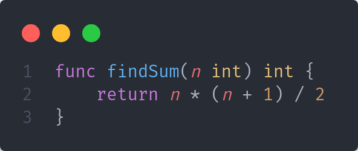
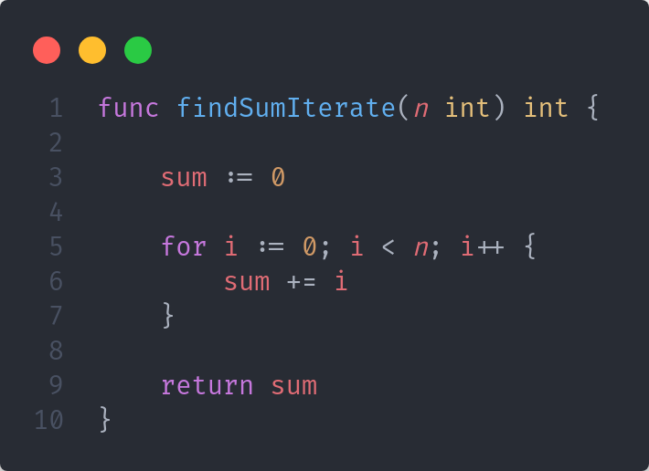
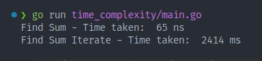
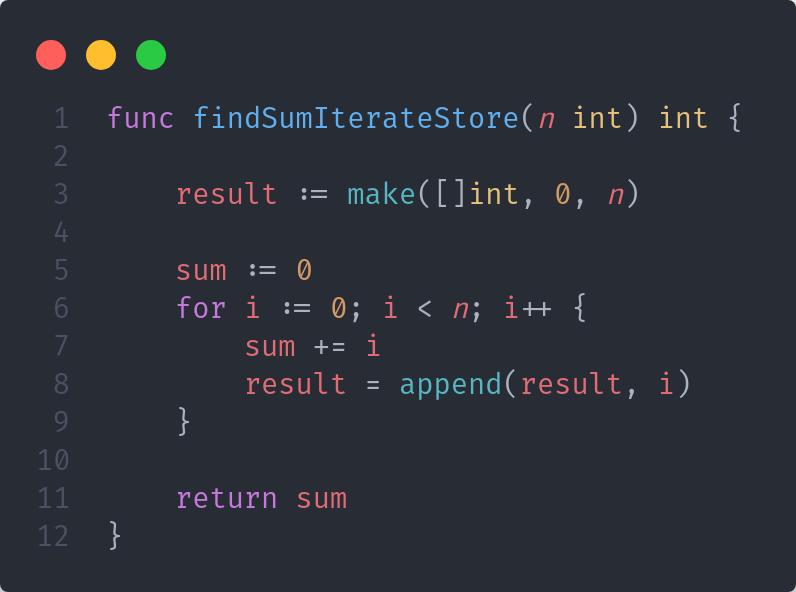
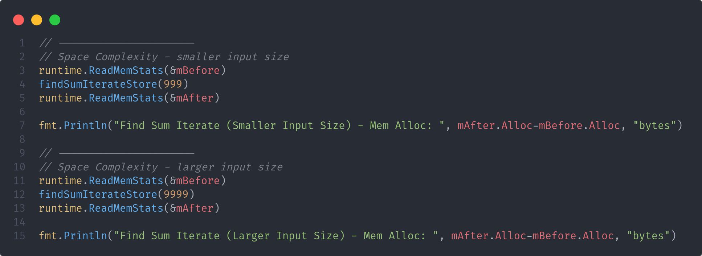
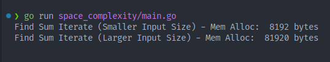

# DSA Study

This repository is intended for my personal study about DSA. The examples was made using Golang

---

## Concepts

### 1. Time Complexity

Time complexity is one of the key parameters used to gauge an algorithm’s performance. It focuses on how the algorithm’s running time scales with the size of its input.

To empirically demonstrate the concept, I've created a function to sum natural numbers using two ways:

#### 1.1 FindSum - O(1)

#### 1.2 FindSumIterate - O(n)

#### 1.3 Result

Both functions will produce the same result but having different performance characteristics, allowing us to use time complexity to illustrate and compare their efficiencies:

---

### 2. Space Complexity

Space complexity is another fundamental metric for evaluating an algorithm’s performance. It describes how the algorithm’s memory usage grows in relation to the size of its input.

To empirically demonstrate the concept, I've created a function to sum natural numbers (like the example before) but, in this case, I've used a function with complexity **O(n)** and I've stored the result on memory heap:

#### 2.1 FindSumIterateStore - O(n)

#### 2.2 Input Parameters

#### 2.3 Result

Using this function, we may prove that that memory usage grows linearly with the input size. Below are the results I've got:

---

### 3. Asymptotic notations

Asymptotic notation provides a way to describe how the running time or space requirements of an algorithm grow as the input size **(n)** becomes very large. The most commonly used notations are:

- **Big O (O):** Provides an upper bound for the function’s growth, describing the _“worst-case scenario”_ or how the function can grow as n increases.

- **Big Omega (Ω):** Provides a lower bound for the function’s growth, describing the _“best-case scenario”_ or how the function at least grows as **n** increases.

- **Big Theta (Θ):** Describes a _“tight bound”_, meaning we have both an upper bound and a lower bound growing at the same order. In other words, we say the function grows exactly at a certain asymptotic rate.

- **Little o (o)**: Provides a strictly smaller upper bound, indicating that a function **f(n)** grows strictly less than another function **g(n)** in asymptotic terms.

- **Little omega (ω):** Provides a strictly larger lower bound, indicating that **f(n)** grows strictly more than **g(n)** as n increases.

**Conclusion**

In most cases, we'll use **Big O (O)** notation to focus on _"worst-case scenario"_ ensuring that we account the maximum resources an algorithm can consume. Or we can analyze possible bottle necks on our logic/source code using this kind of analysis.
